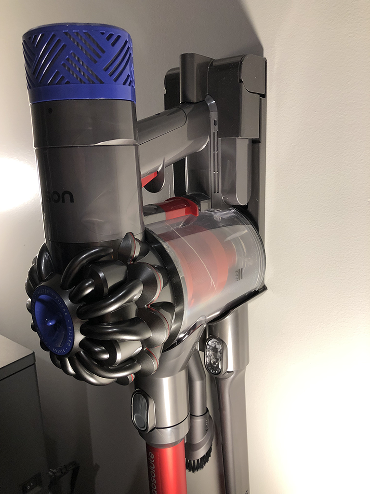
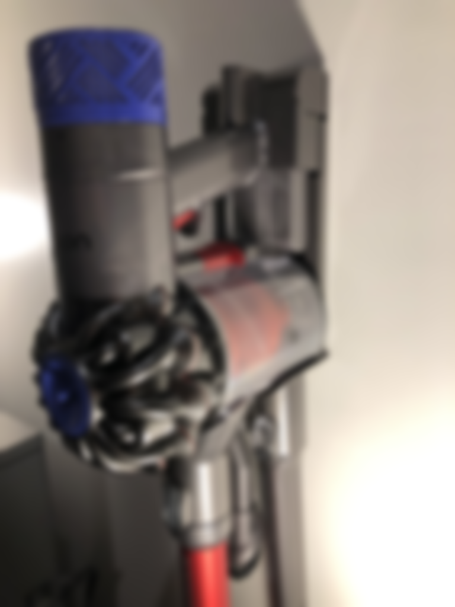
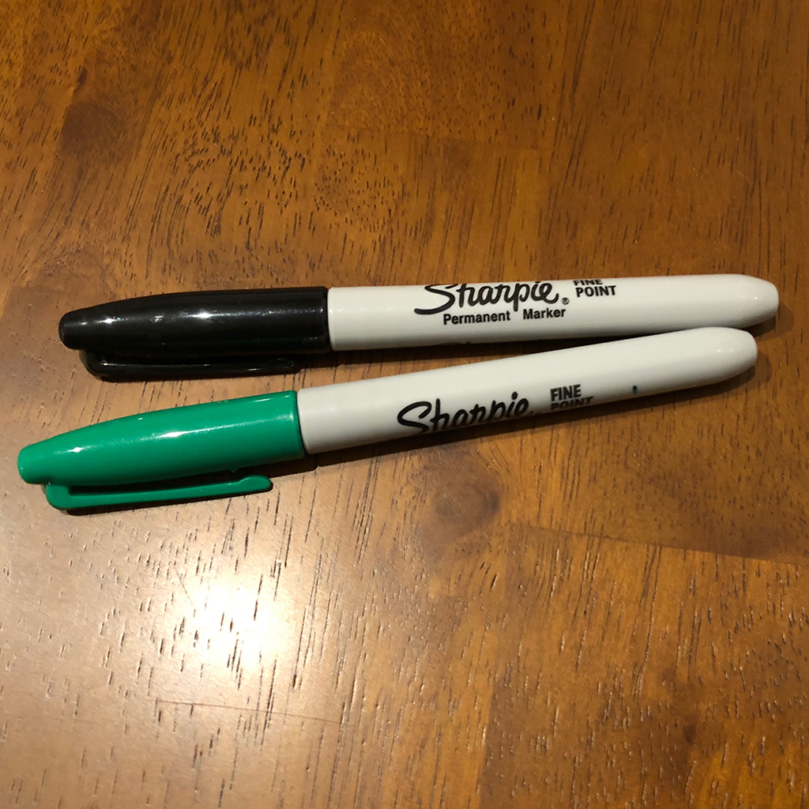
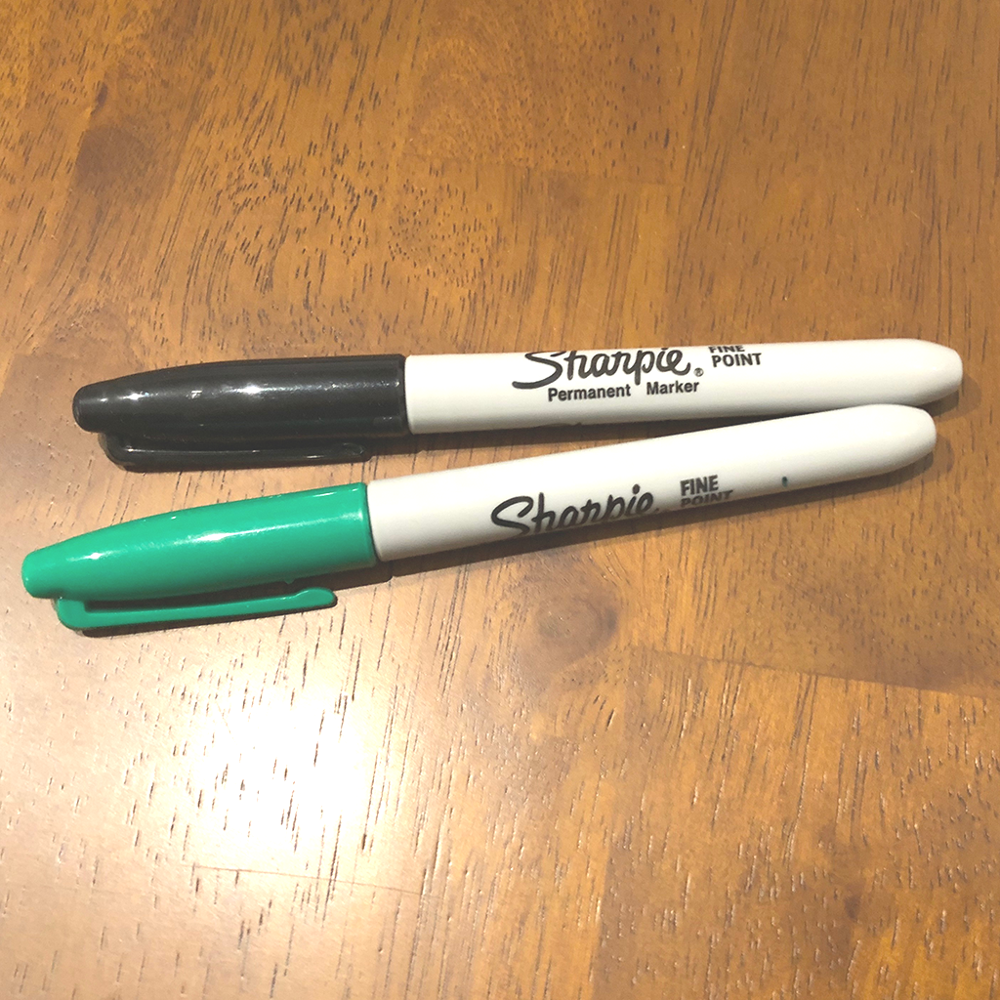
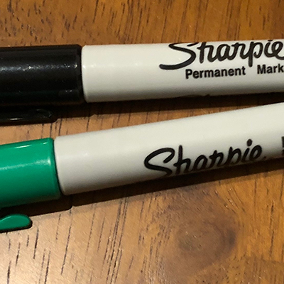
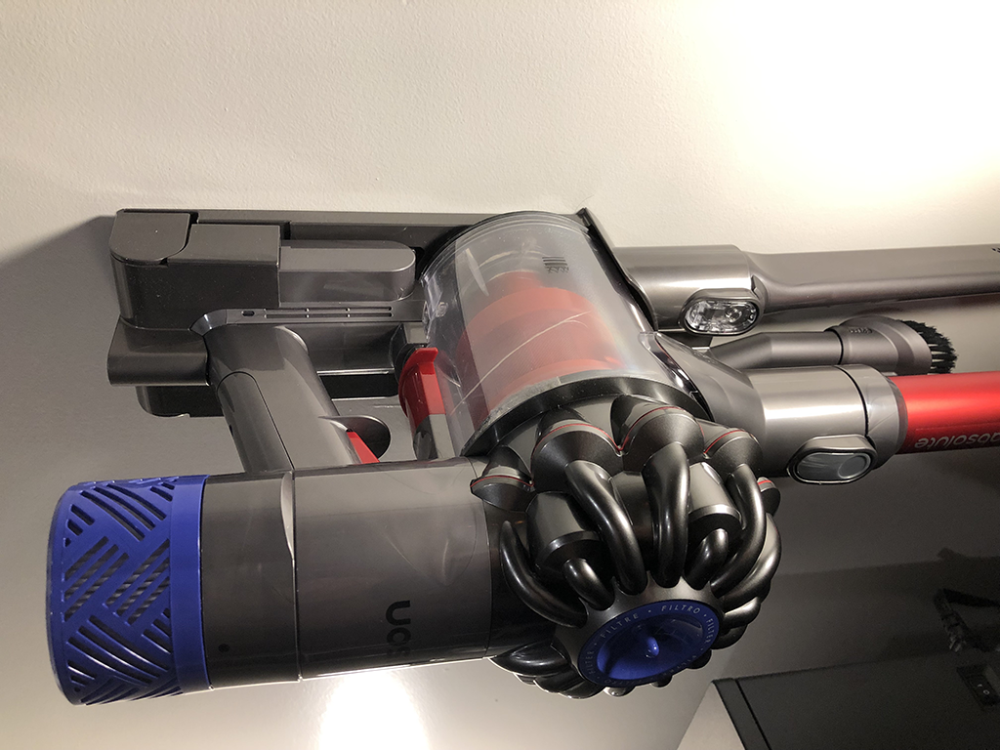
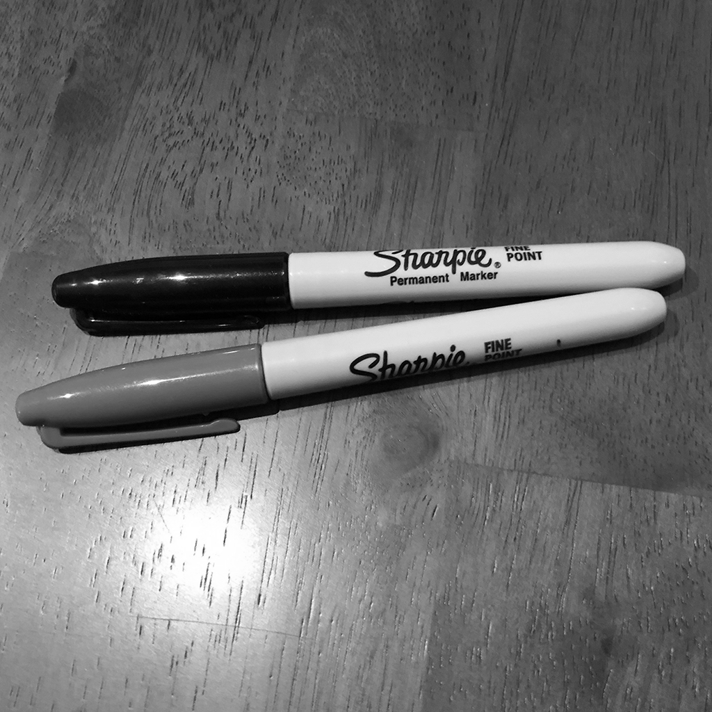
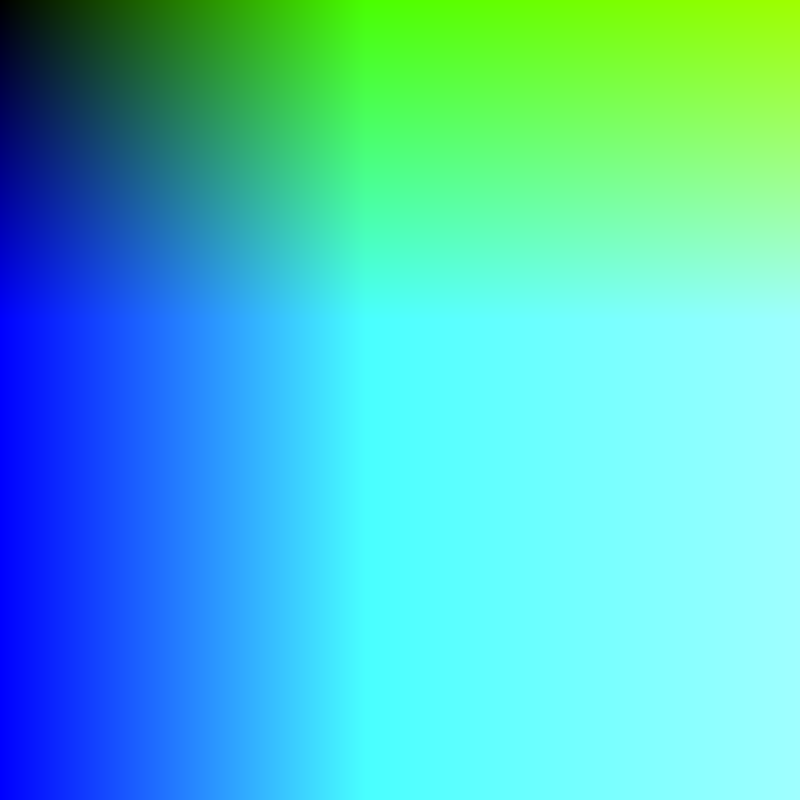
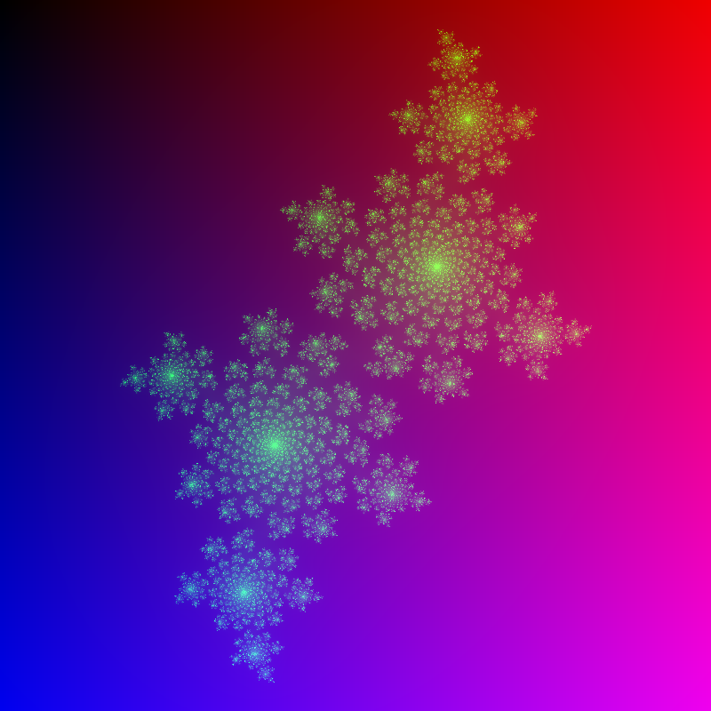

# Rustic Retouch
Image Manipulation Tool written in Rust Programming Language

# Usage:
```
$ ./rustic-retouch
Rustic Retouch - a simple image processing tool written in Rust.
 by: Sujoy De
 
USAGE: [subcommand] [infile] [outfile] [args]
subcommands:
blur INFILE OUTFILE amount(f32)
brighten INFILE OUTFILE amount(i32)
crop INFILE OUTFILE x(u32) y(u32) width(u32) height(u32)
rotate INFILE OUTFILE 90/180/270
invert INFILE OUTFILE
grayscale INFILE OUTFILE
generate OUTFILE red_multiplier(f32) green_multiplier(f32) blue_multiplier(f32)
fractal OUTFILE
``` 
# Features:
## Blur
Usage:
```./rustic-retouch blur INFILE OUTFILE amount(f32)```

Example:
```$ ./rustic-retouch blur dyson.png blur-dyson.png 6 ```
<table><tr><th>Before:</th><th>After:</th></tr><tr><td></td><td></td></tr></table>

## Brighten
Usage:
```./rustic-retouch brighten INFILE OUTFILE amount(i32)```

Example:
```$ ./rustic-retouch brighten pens.png bright-pen.png 50 ```
<table><tr><th>Before:</th><th>After:</th></tr><tr><td></td><td></td></tr></table>

## Crop
Usage:
```./rustic-retouch crop INFILE OUTFILE x(u32) y(u32) width(u32) height(u32)```

Example:
```$ ./rustic-retouch crop pens.png crop-pens.png 300 300 400 400 ```
<table><tr><th>Before:</th><th>After:</th></tr><tr><td></td><td></td></tr></table>

## Rotate
Usage:
```./rustic-retouch rotate INFILE OUTFILE 90/180/270```

Example:
```$ ./rustic-retouch rotate dyson.png rotate-dyson.png 270 ```
<table><tr><th>Before:</th><th>After:</th></tr><tr><td></td><td></td></tr></table>

## Invert
Usage:
```./rustic-retouch invert INFILE OUTFILE```

Example:
```$ ./rustic-retouch invert pens.png invert-pens.png ```
<table><tr><th>Before:</th><th>After:</th></tr><tr><td></td><td></td></tr></table>

## Grayscale
Usage:
```./rustic-retouch grayscale INFILE OUTFILE```

Example:
```$ ./rustic-retouch grayscale pens.png gray-pens.png ```
<table><tr><th>Before:</th><th>After:</th></tr><tr><td></td><td></td></tr></table>

## Generate
Usage:
```./rustic-retouch generate OUTFILE red_multiplier(f32) green_multiplier(f32) blue_multiplier(f32)```

Example:
```$ ./rustic-retouch generate generated.png 0.2 0.7 0.8 ```
<table><tr><th>Image:</th></tr><tr><td></td></tr></table>

## Fractal
Usage:
```./rustic-retouch fractal OUTFILE```

Example:
```$ ./rustic-retouch fractal fractal.png ```
<table><tr><th>Image:</th></tr><tr><td></td></tr></table>
